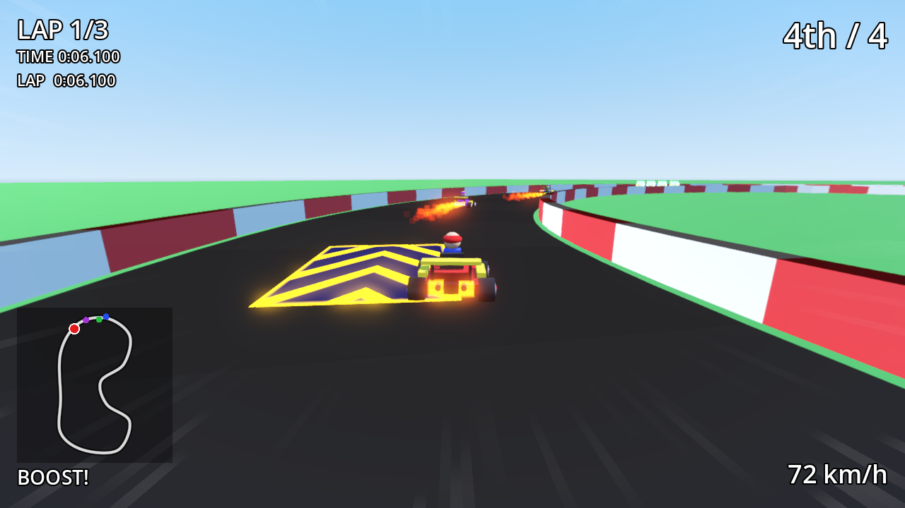
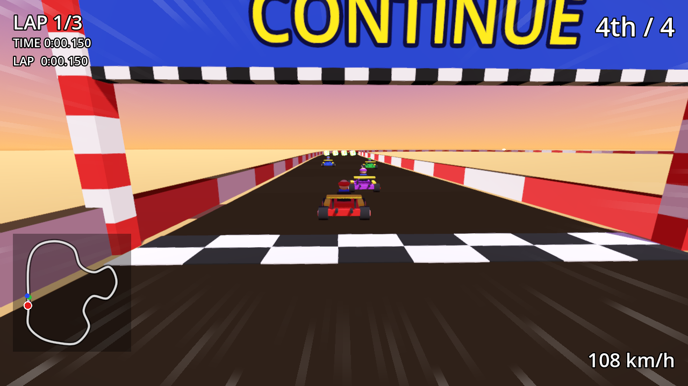
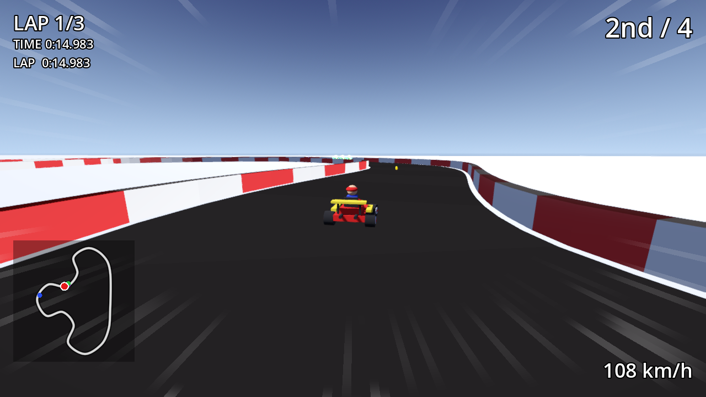
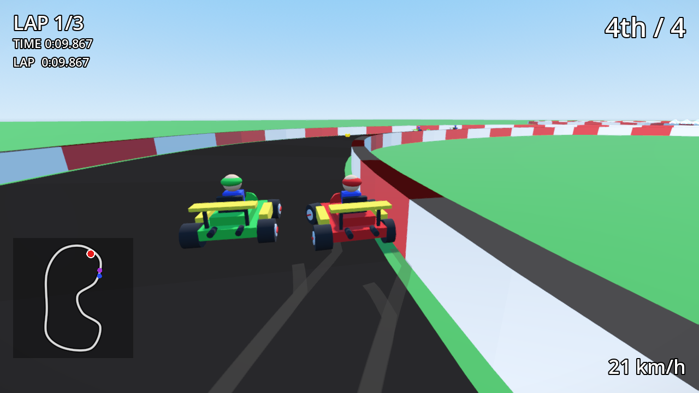

# GoKart

A Mario Kart–style arcade kart racer built with **Godot 4** and GDScript. Everything — track, karts, effects — is generated procedurally from code; there are no imported art assets.

## Screenshots

| Green Hills | Sunset Speedway | Frosty Peaks |
| --- | --- | --- |
|  |  |  |



Taken with `godot --path . -s tools/random_drive.gd` (a bot that wanders the road, drifts and fires items at random).

## Features

- **Arcade kart physics** with drifting and mini-turbo boosts (release a drift to boost), off-road slowdown and wall collisions (`scripts/kart_physics.gd`)
- **Procedural closed-circuit tracks** with meshes, walls and animated boost pads; three tracks (Green Hills, Sunset Speedway, Frosty Peaks) with their own layout, item boxes, hazards and sky/ground colours (`scripts/track_data.gd`, `scripts/track.gd`, `scripts/track_library.gd`)
- **UI scales with the window** (canvas_items stretch, anchored HUD drawn above the speed effects so it stays sharp); 4x MSAA and steady, shadow-free striped walls
- **AI difficulty** Easy / Medium / Hard on the title menu (`TrackLibrary.DIFFICULTIES`), with Mario Kart 64–style **rubber-banding**: AI karts that fall behind you get a top-speed bonus and karts far ahead ease off, scaled by difficulty (`AiDriver.rubber_band`)
- **Engine classes** 50cc / 100cc / 150cc like Mario Kart 64 (Z / C on the title menu): the class scales every kart's top speed and acceleration, player and AI alike (`TrackLibrary.ENGINE_CLASSES`, `KartPhysics.apply_engine_class`)
- **Title menu** to pick the track (A / D or arrows) and the lap count (W / S, 1/2/3/5/7 laps), Enter to race; Esc in a race returns to it (`scripts/menu.gd`)
- **Grand Prix cup** (G on the menu): every track is raced in turn, Mario Kart 64 points (9 / 6 / 3 / 1) add up after each race, the standings follow the results and the cup ends with a gold, silver or bronze trophy (`scripts/grand_prix.gd`)
- **3-lap races** with ordered checkpoints and live race ranking (`scripts/lap_tracker.gd`, `scripts/race_ranking.gd`)
- **Start countdown** (3-2-1-GO) with a rocket-start boost for well-timed throttle (`scripts/race_start.gd`)
- **AI opponents** — a Mario Kart 64 field of 8 racers on a two-column grid (you start at the back) — using pure-pursuit steering, corner speed limiting, stuck recovery and item use (`scripts/ai_driver.gd`, grid in `scripts/main.gd`)
- **Items** from rainbow `?` item boxes with a roulette: mushroom, triple mushrooms (three boosts, "x3" counter on the HUD), golden mushroom (Mario Kart 64 style: unlimited boosts for 7.5 s after the first press, never rolled by the leader), banana, green shell (ricochets), red homing shell, triple shells (three orbiting green shells fired one by one), blue spiny shell (hunts the leader along the road and explodes), star and lightning (`scripts/items.gd`, `item_holder.gd`, `item_manager.gd`, `item_projectile.gd`). Getting hit spins the kart out; lightning shrinks and slows every rival (`lightning_bolt.gd`).
- **Visual effects**: drift sparks, boost flames, tire trails, speed lines / boost blur, and custom shaders in `shaders/`
- **Results screen**: after you finish, an autopilot takes over and a standings table with MK64 points appears; Enter restarts, or moves on to the next cup race (`scripts/race_results.gd`)
- **Procedural audio**: synthesized engine loop (pitch follows speed), tire screech while drifting, countdown beeps, boost / mini-turbo / item / hit / explosion / lightning / star sounds and a finish jingle, plus positional 3D engine hum on each AI kart, with no audio files (`scripts/ai_engine_audio.gd`, `scripts/sound_synth.gd`, `scripts/game_audio.gd`)
- **HUD** with place, lap, item slot and a track minimap (`scripts/hud.gd`, `scripts/minimap.gd`)
- **Procedural kart model** with steering front wheels and spinning wheels (`scripts/kart_model.gd`)

## Controls

| Key | Action |
| --- | --- |
| W / S or Up / Down | Accelerate / brake |
| A / D or Left / Right | Steer (eased in, Mario Kart style) |
| Space or Shift | Drift (release for mini-turbo) |
| E, Enter or Ctrl | Use the held item (a hint shows under the item name) |
| Q / E (menu) | AI difficulty: Easy / Medium (default) / Hard |
| Z / C (menu) | Engine class: 50cc / 100cc / 150cc (default) |
| G or Tab (menu) | Mode: Single Race / Grand Prix |
| Enter | Race again or next cup race (on the results screen) / start race (menu) |
| Esc | Back to the track menu |

## Download

Prebuilt binaries are on the [releases page](https://github.com/AgentiLoop/GoKart/releases/latest) — no Godot install needed:

| Platform | Download |
| --- | --- |
| macOS (universal: Apple silicon and Intel, Developer ID signed and notarized) | `GoKart-<version>-macos-universal.zip` |
| Windows (x86_64, unsigned — expect a SmartScreen prompt) | `GoKart-<version>-windows-x86_64.zip` |
| Linux (x86_64) | `GoKart-<version>-linux-x86_64.tar.gz` |
| Linux (arm64) | `GoKart-<version>-linux-arm64.tar.gz` |

Each download is a single self-contained binary with the game data embedded. `SHA256SUMS.txt` on the release page lists the checksums.

## Running from source

Requires [Godot 4.4+](https://godotengine.org/).

```sh
git clone https://github.com/AgentiLoop/GoKart.git
cd GoKart
godot --path .          # run the game (opens the title menu: scenes/menu.tscn)
```

## Testing

```sh
./run_tests.sh                                  # headless unit tests (tests/)
godot --headless --path . -s tools/smoke.gd -- 1  # headless race smoke test with AI karts (arg = track index)
godot --headless --path . -s tools/menu_check.gd  # menu -> race -> Esc flow check
godot --headless --path . -s tools/gp_check.gd    # Grand Prix flow check (menu -> cup race 1 -> results -> race 2 -> Esc)
godot --path . -s tools/screenshot.gd           # visual check, writes /tmp/gokart_*.png
godot --path . -s tools/random_drive.gd -- 1    # random drive, 3 screenshots -> /tmp/gokart_random_*.png (arg = track index, random if omitted)
```

## Project layout

```
scenes/   menu and race scenes
scripts/  game logic (physics, track, AI, items, HUD, effects)
shaders/  boost pad, item box, shell, star and speed-fx shaders
tests/    unit tests and test runner
tools/    smoke test and screenshot helper
```
