# GoKart

A Mario Kart–style arcade kart racer built with **Godot 4** and GDScript. Everything — track, karts, effects — is generated procedurally from code; there are no imported art assets.

## Screenshots

| Green Hills | Sunset Speedway | Frosty Peaks | Dusty Canyon |
| --- | --- | --- | --- |
|  |  |  | 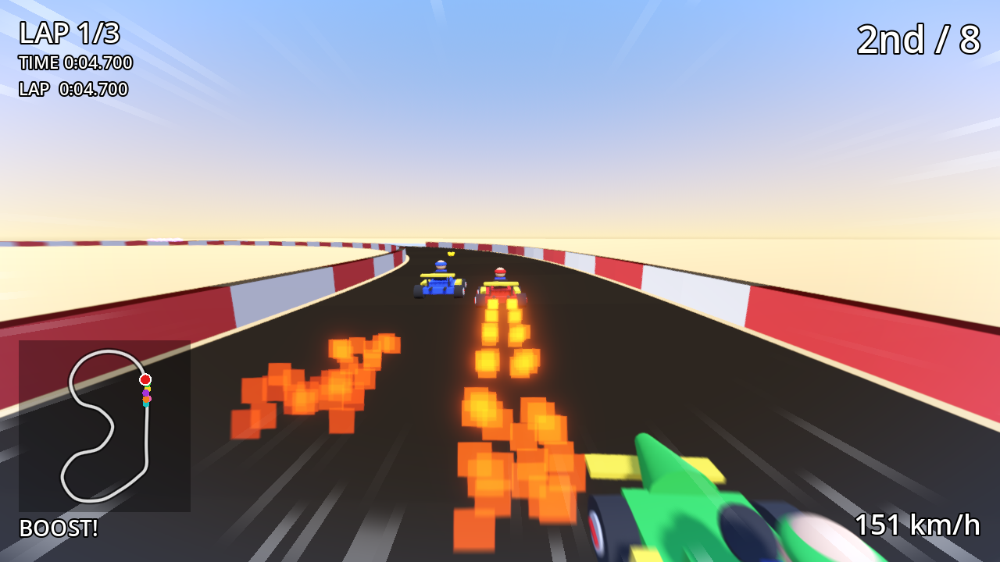 |

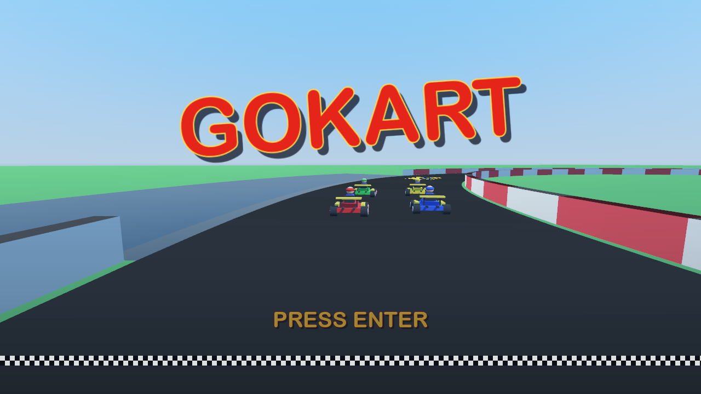


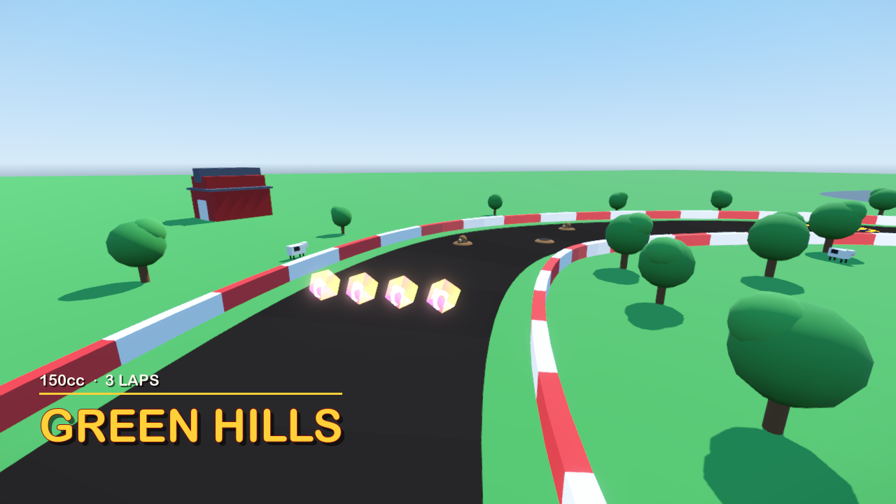

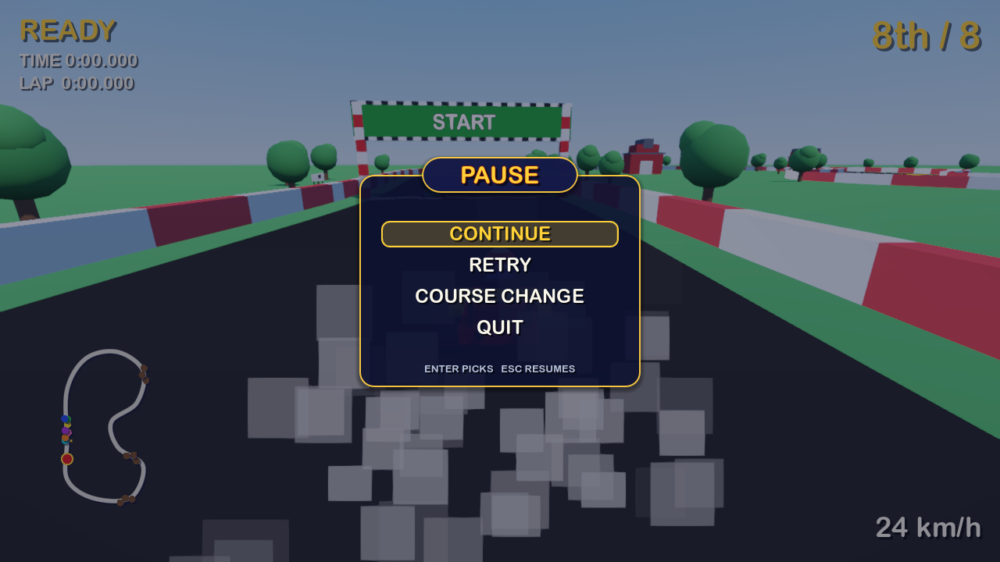


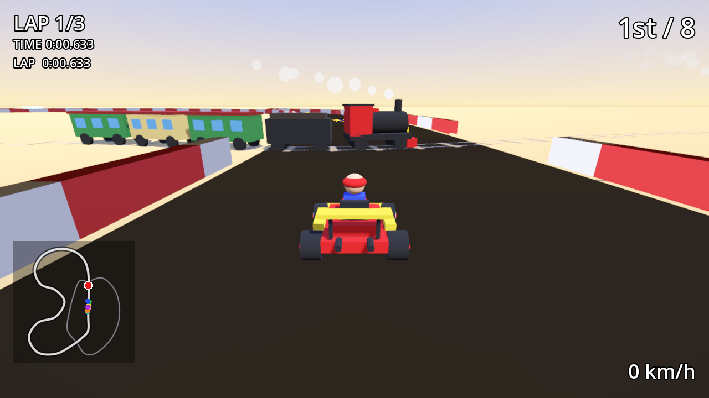

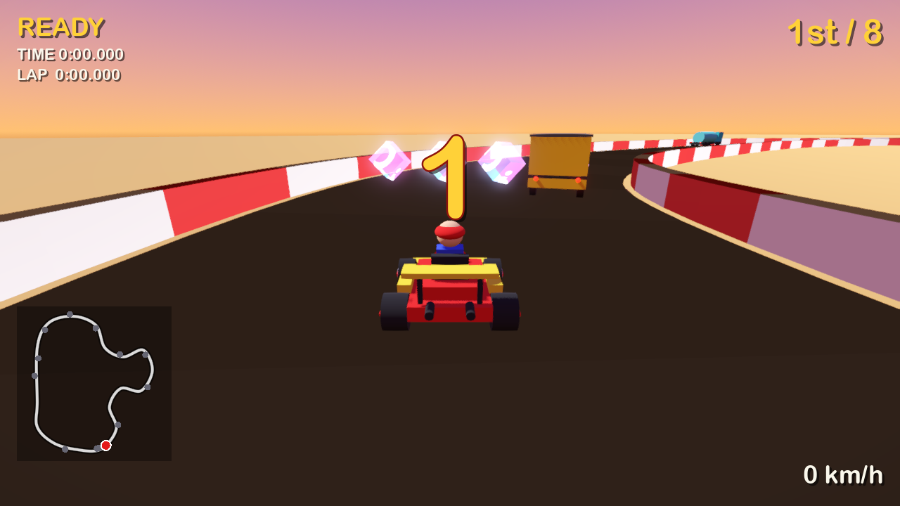

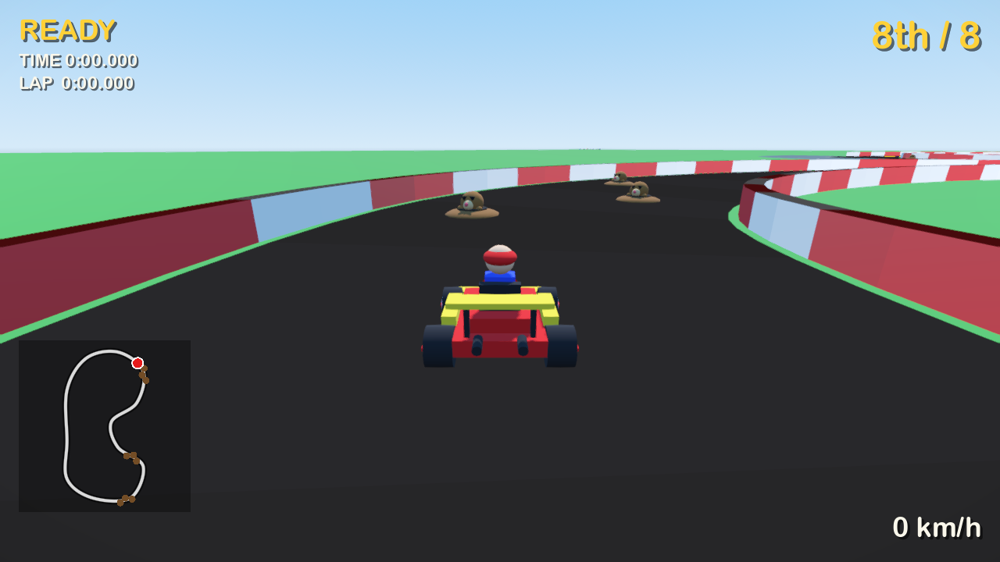

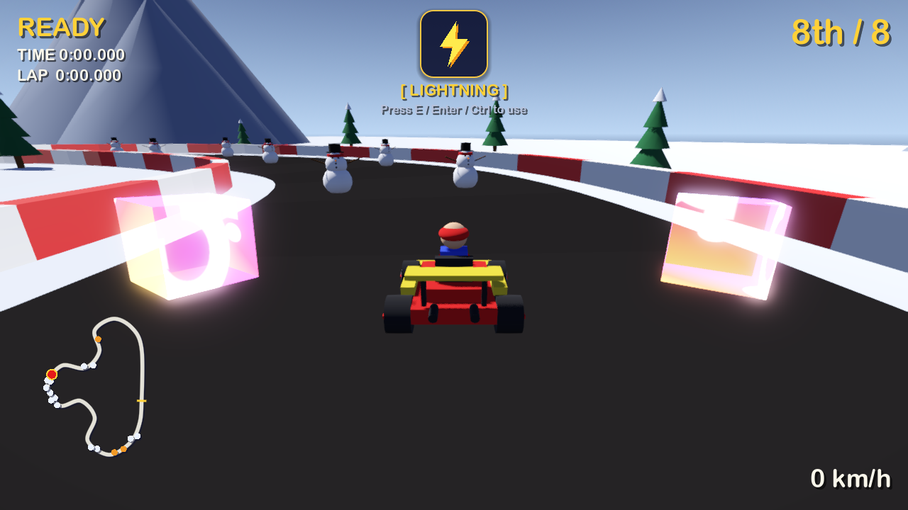

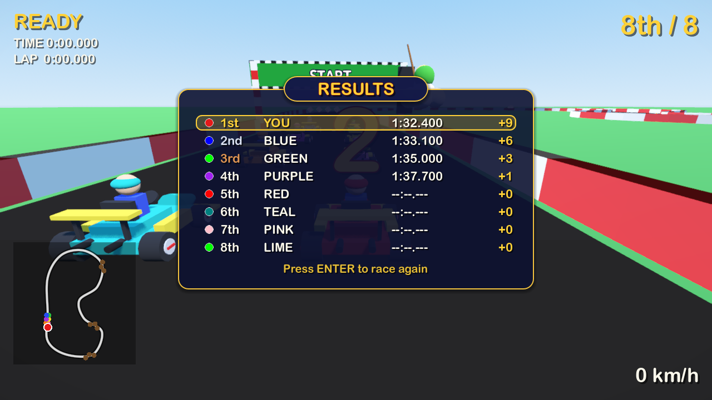

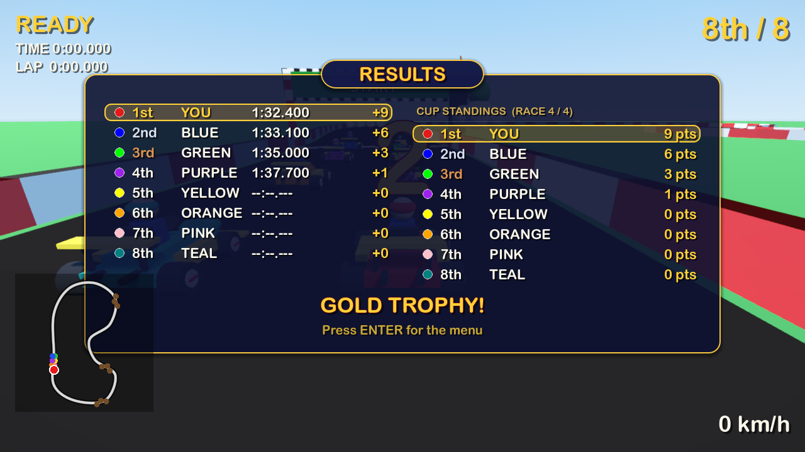

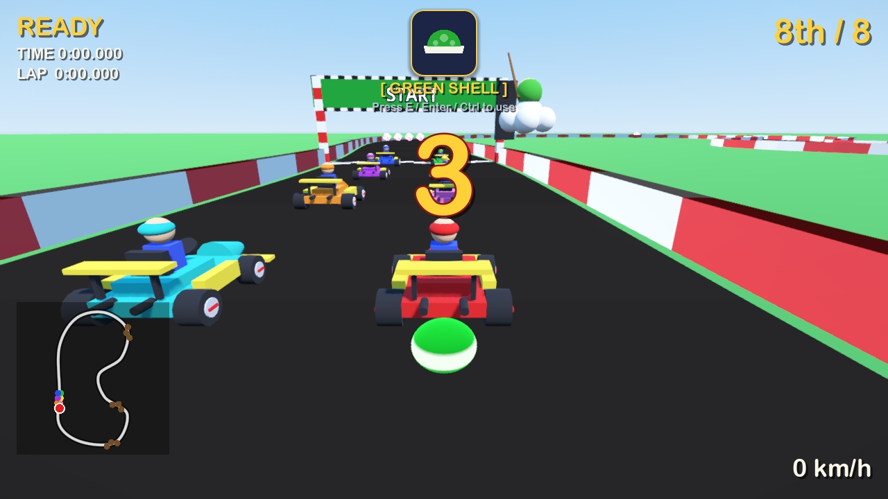

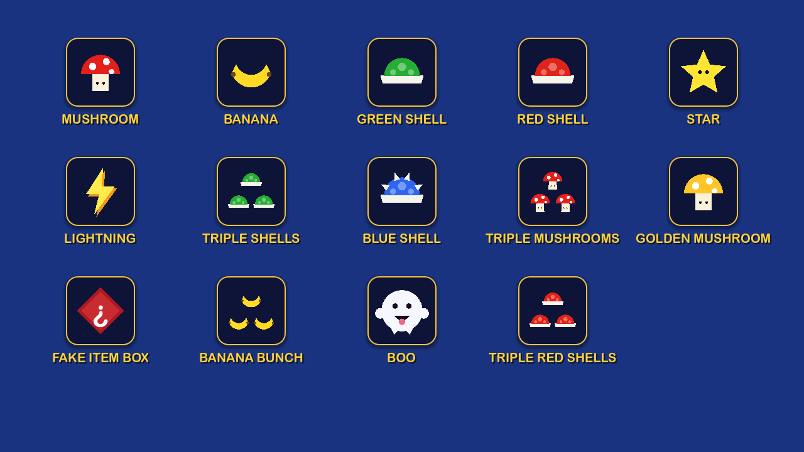

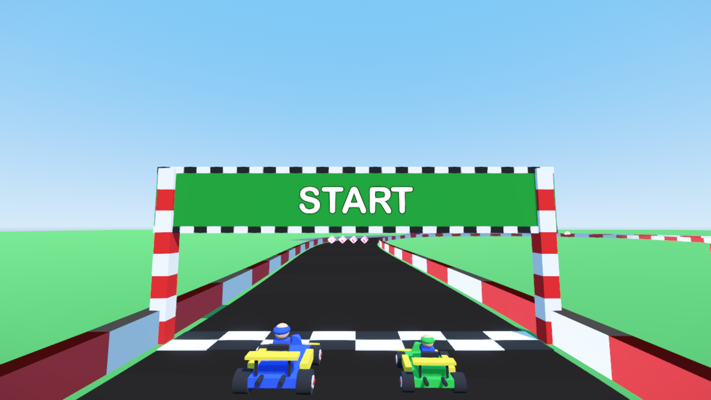

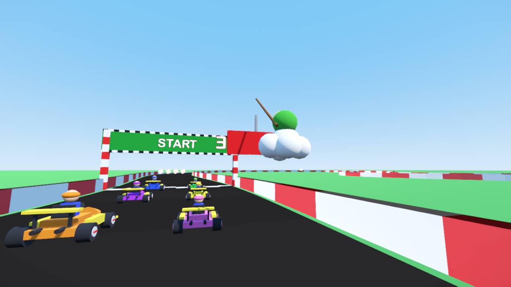

Taken with `godot --path . -s tools/random_drive.gd` (a bot that wanders the road, drifts and fires items at random), `tools/train_shot.gd`, `tools/traffic_shot.gd`, `tools/mole_shot.gd`, `tools/snowman_shot.gd`, `tools/menu_shot.gd`, `tools/intro_shot.gd`, `tools/pause_shot.gd`, `tools/hud_shot.gd`, `tools/item_shot.gd` and `tools/sign_shot.gd`.

## Features


- **The train** (Mario Kart 64 Kalimari Desert): Dusty Canyon has a railway loop that crosses the road at two level crossings, and two steam trains (locomotive with a smoking chimney and a "64" plate, tender, three coaches) circle it without end. A crossbuck signal before each crossing flashes its red lamps and a bell rings while a train is close or passing; drive into a car and you are **thrown into the air**, spun out and shoved along the train (a Star or Boo goes straight through). CPU karts always stop and wait at a blocked crossing, like MK64's; the walls open where the rails cross and the minimap shows the railway (`scripts/train.gd`, `scripts/railway.gd`, `TrackData` `rail` layout / `crossings`, `Kart.launch`, `AiDriver.wait`)
- **Traffic** (Mario Kart 64 Toad's Turnpike): Sunset Speedway is a public road — white cars, yellow buses, red box trucks and cyan tankers with lit headlights drive round it without end in two lanes (the fast lane on the left, the slow lane on the right), the same way as the racers, crawling in 50cc and quick in 150cc; in the **Extra** class they come **towards you** at 150cc speed like MK64's mirror mode. The traffic sets off at GO, items fly straight through it, and touching any vehicle **throws you into the air**, spins you out and shoves you along (a Star or Boo passes through). CPU karts look ahead and weave round the vehicles in their lane — through the gap between the lanes or into the other lane — and the minimap shows every vehicle as a grey dot (`scripts/traffic.gd`, `scripts/highway.gd`, `TrackData` `traffic` layout, `AiDriver.dodge_lane`)
- **Monty Moles** (Mario Kart 64 Moo Moo Farm): Green Hills has three groups of mole holes in the road, staggered left / right / left about 10 m apart. Brown Monty Moles with tan snouts and triangular shades hop out of them and sink back in a staggered rhythm (out for 1.4 s every 3.2 s, neighbouring holes offset, facing the oncoming racers); run into a mole that is out and you are **thrown into the air** and spin out (a Star kart bowls the mole over instead). A green or red shell flying over a hole **knocks the mole away** (the shell is spent on it, pop sound) and it stays underground for 6 s before it dares to come back. CPU karts look 40 m ahead and steer round the holes — down the middle between a left and a right hole or past the outside — and the minimap shows every hole as a brown dot (`scripts/moles.gd`, `scripts/molehills.gd`, `TrackData` `moles` layout, `Main._dodge`)
- **Snowmen** (Mario Kart 64 Frappe Snowland): Frosty Peaks has thirteen snowmen standing about the road — two by the edges after the esses, a field of five staggered rows (singles, a pair and a gate about 14 m apart) on the run after the long sweeper, a left / right pair before the last pad and a gate near the end. Three snowballs, coal eyes, a carrot nose, a red scarf, a black top hat and stick arms, facing the oncoming racers; run into one and you are **thrown into the air** and spin out while the snowman **bursts into a puff of snow** (a Star kart bursts it and drives on). A green or red shell flying into a snowman smashes it too (the shell is spent on it, pop sound); a smashed snowman grows back out of the snow 5 s later. CPU karts look 40 m ahead and **weave through the rows**: they aim for the gap in the nearest row that costs the least steering through the rows behind it (moving early rather than late, ties to the middle of the road), and the minimap shows every snowman as a white dot (`scripts/snowmen.gd`, `scripts/snowfield.gd`, `TrackData` `snowmen` layout, `Main._dodge`)
- **Ice** (Mario Kart 64 Sherbet Land): two stretches of Frosty Peaks — the bend before the second pad and the long sweeper before the last snowmen — are sheet ice across the whole road, a pale blue-white glossy ribbon you can see coming. On ice the tires bite less: the nose still turns but the kart keeps sliding the way it was going and only slowly comes round (it travels sideways of its nose, up to 45°), the brakes and coasting bleed speed less than half as fast, so brake before the ice and turn in early, or drift; the slide is gone a few frames after the tarmac returns and a crawling kart does not slide. CPU karts slide too and lift off for an icy bend before they reach it (`TrackData.ice` / `on_ice` / `ice_ahead`, `KartPhysics.grip` / `slide`, `AiDriver.grip`, ribbon in `scripts/track.gd`)
- **Jump ramp** (Mario Kart 64 Wario Stadium / Royal Raceway): Dusty Canyon has a ramp across the road thirty metres after the line — a sandy wedge rising 2.4 m over twelve metres, pale bands before the lip, a sheer drop behind it and tall walls along the ramp and the landing. A kart rides up the slope nose-up and flies off the lip along it (at full speed about half a second and seven road samples in the air, snatching the item boxes just past the lip on the way), with a whoosh on take-off and a thump and a puff of dust from every wheel on landing; in the air the throttle, brakes and friction do nothing and the stick only nudges the nose, the body pitches up on the way up and down on the way down. CPU karts take the ramp too; a hop into a powerslide is not a jump (`TrackData.jumps` / `jump_at` / `ramp_height`, `Kart.ramp_lift` / `airborne` / `pitch_for`, `KartPhysics.airborne`, wedge in `scripts/track.gd`)

- **Roadside scenery** like Mario Kart 64's course dressing: every course is dressed to its theme beyond the walls — Green Hills has round trees, black-and-white cows grazing by the road and red barns in the fields (Moo Moo Farm), Sunset Speedway runs between city buildings with lit window bands under street lamps that reach over the road and billboards facing the traffic (Toad's Turnpike), Frosty Peaks has snow-capped fir trees, igloos and a mountain range (Frappe Snowland), Dusty Canyon cacti and rocks beside the road with mesas on the horizon (Kalimari Desert). The props are placed by rules per set (a kind every so many road samples, a random distance beyond the wall, a random size) and keep off every part of the road, out of the water, off the railway and apart from each other; the layout is deterministic and the Extra class gets its exact mirror image. Twelve kinds built from boxes, spheres, cylinders and cones, drawn as one MultiMesh batch per part, so hundreds of props cost a dozen draw calls; the attract demo and the course picture show them too (`scripts/scenery.gd`, `scripts/scenery_props.gd`, `TrackData` `scenery` layout)
- **Slipstream** like Mario Kart 64's drafting (introduced in MK64): trail close behind another kart — in its wake, within 12 m straight behind it, both rolling the same way — for about two seconds and you get a **brief burst of speed** (top speed +15 % for 1.5 s, with grey wind streaking past the kart like MK64's grey draft wind and a soft whoosh), enough to close in and ram the kart ahead; nothing shows while the draft charges, as in MK64. Leaving the wake, a hit, a false start or a Lakitu rescue drops the charge; a mushroom or pad boost outranks the burst and off-road scales it like any top speed. CPU karts draft too, player and AI alike (`scripts/slipstream.gd` wake geometry, `KartPhysics.update_draft`, wind in `scripts/kart_effects.gd`)
- **Arcade kart physics** with Mario Kart 64 powerslides: the kart **hops** into the slide (light karts hop higher) and the smoke behind it is white; **toggle the stick against the slide and back** once and the smoke turns yellow, twice and it turns red — release on red for the **mini-turbo** boost (release on yellow or hold a steady slide and there is none, like MK64). Off-road slowdown and wall collisions too (`scripts/kart_physics.gd`, hop in `scripts/kart.gd`)
- **Procedural closed-circuit tracks** with meshes, walls and animated boost pads; four tracks — a Mario Kart 64 cup's worth — (Green Hills, Sunset Speedway, Frosty Peaks and the desert course Dusty Canyon with its sweepers, hairpin and oasis) with their own layout, item boxes, hazards and sky/ground colours (`scripts/track_data.gd`, `scripts/track.gd`, `scripts/track_library.gd`)
- **UI scales with the window** (canvas_items stretch, anchored HUD drawn above the speed effects so it stays sharp); 4x MSAA and steady, shadow-free striped walls
- **AI difficulty** Easy / Medium / Hard on the title menu (`TrackLibrary.DIFFICULTIES`), with Mario Kart 64–style **rubber-banding**: AI karts that fall behind you get a top-speed bonus and karts far ahead ease off, scaled by difficulty (`AiDriver.rubber_band`)
- **Engine classes** 50cc / 100cc / 150cc / Extra like Mario Kart 64 (Z / C on the title menu): the class scales every kart's top speed and acceleration, player and AI alike; **Extra** is MK64's mirror mode — 150cc speed on every course flipped left-to-right (the menu preview flips too, pads and hazards swap sides) (`TrackLibrary.ENGINE_CLASSES`, `KartPhysics.apply_engine_class`, `TrackData` `mirror` layout flag)
- **Weight classes** Light / Medium / Heavy like Mario Kart 64's driver roster (X / V on the title menu): light karts accelerate fastest but get thrown aside, heavy karts have the highest top speed, the slowest pick-up and shove others out of the way; kart-to-kart bumps throw both karts apart along the contact, the lighter one much further and slowed, the heavier one keeping its speed. The 7 AI karts mix all three classes and heavy karts are visibly bigger (`scripts/kart_weight.gd`, `Kart.apply_weight_class`, `Kart._bump`, `Main.AI_SPECS`)
- **Title screen** like Mario Kart 64's: the **GOKART logo** — chunky letters set on an arch like MK64's logo, each shaded from light yellow through orange to red (`shaders/logo_gradient.gdshader`) with a dark red rim, standing out of a deep navy extrusion like MK64's 3D block letters (no black) — sits over a live **attract demo** — four CPU karts lapping the highlighted course in their own 3D viewport behind the menu, watched by a chase camera that hops from kart to kart — with a blinking PRESS ENTER (the demo **tours the courses** like MK64's attract mode: every 15 s it dips to navy under the logo and comes back on the next course, and the select screen opens on the course being watched); Enter brings up the **select screen** laid out like MK64's (the demo keeps running, dimmed, behind it): a "SELECT COURSE" banner, the course list on the left — like MK64's map-select pictures, a little landscape in the course's own sky and ground colours with the road loop across it beside every name, the highlighted row lit in gold with its picture framed in gold — a live **course picture** in a framed window — like MK64's course select, which shows a picture of the course beside the map: a second viewport looks into the demo's world through a camera flying along the road, above and to the right of the centre line, with the course's map outline laid over the picture's corner (in battle mode the demo and the picture show the **picked arena** instead, like MK64's battle map select: four balloon karts patrol the arena's ring of item boxes — two each way round, so they meet and jostle — while the picture camera circles the arena from above) — the course blurb beside it and the option rows underneath — like MK64's Select Mode screen every choice is listed and the picked one is lit: laps 1 / 2 / 3 / 5 / 7, CPU Easy / Medium / Hard, engine 50cc / 100cc / 150cc / Extra, kart Light / Medium / Heavy (its blurb under the row, and beside it a live **kart portrait** like MK64's Player Select, which shows the driver you picked: the player's kart at the picked class's size — light small, heavy big — in a little 3D window of its own, turning on a gold showroom turntable and hopping once when the class changes, its frame gold while the cursor is on the KART row; `scripts/kart_portrait.gd`) and the mode tabs SINGLE RACE / GRAND PRIX / TIME TRIAL / BATTLE as gold pills on a lit bar, the rest dim; a fixed value (time-trial laps, battle balloons) sits alone in grey; a blinking PRESS ENTER under the checkered band; a rounded system font with soft drop shadows instead of heavy black outlines. The screen is driven like an MK64 menu — one stick, one button: Up / Down move a pulsing gold **cursor frame** from row to row (the course list, laps, CPU, engine, kart, the mode tabs — a time trial's fixed rows and the battle balloons are skipped), Left / Right change whatever the frame is on, only the focused row's lit bar glows (the others keep a dim rim) and its caption turns gold; the letter keys (W / S, Q / E, Z / C, X / V, G) still work as shortcuts without moving the frame, so the per-cell key hints are gone and one grey line explains the arrows. Enter races; Esc in a race brings up the pause screen (`scripts/menu.gd`, `scripts/attract.gd`). **Menu sound** like MK64's: a title tune (a brassy fanfare) loops under the title screen and a select tune (a two-bar bass ostinato with brief licks, like MK64's "Selection Screens") takes over with a cross-fade on the select screen — both chiptune loops rendered from code — the cursor ticks, an option key ticks lower and Enter chimes; starting a race hands the chime and the tune to the scene root so the chime plays out and the tune fades while the race loads (`scripts/menu_audio.gd`). **Screen motion** like MK64's: on launch the logo flies in from the distance and bounces to a stop over the demo with a low thud (MK64's title call as the logo arrives) before PRESS ENTER and the footer line under the checkered band (MK64's title carries its copyright line there) fade in; leaving the title, the logo glides up to its select-screen spot while the demo dims and the panels rise into place (half a second); back from a race the select screen is simply there
- **Grand Prix cup** (G on the menu): all four tracks are raced in turn like an MK64 cup, Mario Kart 64 points (9 / 6 / 3 / 1) add up after each race, the standings follow the results and the cup ends with a gold, silver or bronze trophy. MK64 cup rules: finish **5th or worse and you rank out** — nothing is scored and the same race is run again (unlimited retries, the HUD shows "RACE 2 / 4  RETRY"); and from the second race on **everyone starts where they finished** the last race (win and you take pole, the player starts 8th only in the first race) (`scripts/grand_prix.gd`, `Main.GRID_SLOTS`)
- **Time Trials** (G again on the menu), Mario Kart 64 style: race alone for 3 laps at 100cc with a triple mushroom and no item boxes; the five best times and the best lap of each track are saved (`user://time_trials.cfg`) and your fastest run comes back as a see-through, untouchable ghost kart that drives the exact same path on the next attempt (`scripts/time_trial.gd`, `scripts/ghost_recording.gd`, `scripts/ghost_kart.gd`)
- **3-lap races** with ordered checkpoints and live race ranking (`scripts/lap_tracker.gd`, `scripts/race_ranking.gd`)
- **Course intro** like Mario Kart 64's: when a race starts from the menu (or the next cup race from the results board) the countdown waits while the camera **flies over the course** in three cuts — low over the road, to the right of the centre line, looking down the road, each cut on another stretch, the last ending over the grid — and a name card fades in and rises in the bottom-left corner: the course name as a gold sign with the dark red rim over a gold rule, with the mode and class underneath in cream ("GRAND PRIX  ·  RACE 1 / 4  ·  150cc", "TIME TRIAL  ·  100cc", "150cc  ·  3 LAPS"); the race HUD stays away until the intro ends. Enter or the throttle skips it and the camera cuts to the chase spot; a race scene loaded directly gets no intro (`scripts/course_intro.gd`, card in `scripts/hud.gd`, `Main.intro_t`)
- **Pause screen** like Mario Kart 64's: Esc during a race or a battle freezes everything where it is — karts, timers, Lakitu, the music — and a small navy panel with a gold rim pops up in the middle of the frozen picture (a quick zoom with one overshoot, like the title logo), PAUSE as a gold sign on its top edge, then CONTINUE / RETRY / COURSE CHANGE / QUIT, the picked line gold on a lit bar over a navy veil that dims the race; Up / Down move the cursor with a tick, Enter picks with a chime (RETRY runs the same race again from its course intro, nothing scored; COURSE CHANGE goes back to the select screen; QUIT to the title screen), Esc resumes — a two-note down-step as the panel opens, the same two notes up as it closes. Drop shadows, no black outlines (`scripts/pause_menu.gd`; Esc on the results board still goes straight back to the select screen)
- **Start countdown** (3-2-1-GO) with a Mario Kart 64 rocket start: press the throttle just before the blue light for a boost; hold it too early and the kart does a **false start** — tires burn out in a cloud of smoke, the engine revs and the kart sits still for 1.5 s (`scripts/race_start.gd`, `stall` in `scripts/kart_physics.gd`)
- **Lakitu**, the Mario Kart 64 referee on his cloud: he hovers ahead of your kart holding the start signal on his fishing rod (lamps light red, red, then blue at GO), holds up a green "LAP 2" / "FINAL LAP" sign as you cross the line, waves the checkered flag when you finish, and flashes a red **REVERSE** sign if you drive the wrong way for a second. Every course has **water** beside the road along two open stretches (no wall there, on the outside of a bend; mirrored with the Extra class): drive off the edge and you splash in, Lakitu fishes you out on his line (lifted, carried over the centreline and set down facing the right way, speed gone — a few seconds lost, AI karts too) (`scripts/lakitu.gd`, `TrackData` `water` layout / `in_water` / `has_wall`, `Kart.start_rescue`)
- **Battle mode** (G again on the menu), Mario Kart 64 Balloon Battle: four karts with three balloons each in one of three arenas picked with Left/Right — **Big Donut** (a ring around a lava pit), **Block Fort** (four solid forts, shells ricochet off everything) and **Skyscraper** (a rooftop with no railings). Any item hit, a fall into the lava / off the roof, a star kart's touch or a hard shove from a heavier kart pops a balloon; with none left you become a **Mini Bomb Kart** that can still drive (no items) and blows up on the first balloon kart it rams, costing it a balloon. Last kart with balloons wins; battle AI hunts item boxes when empty-handed and chases the nearest balloon kart with an item, feeling its way around the walls, forts and the lava. Only the MK64 battle items are rolled (no blue shell, lightning, golden or triple mushrooms) (`scripts/battle.gd`, `scripts/arena_data.gd`, `scripts/arena.gd`, `scripts/battle_ai.gd`, `scripts/balloons.gd`, `scripts/battle_main.gd`)
- **AI opponents** — a Mario Kart 64 field of 8 racers on a two-column grid (you start at the back) — using pure-pursuit steering, corner speed limiting, stuck recovery and item use (`scripts/ai_driver.gd`, grid in `scripts/main.gd`)
- **Items** from rainbow `?` item boxes with a roulette: mushroom, triple mushrooms (three boosts, "x3" counter on the HUD), golden mushroom (Mario Kart 64 style: unlimited boosts for 7.5 s after the first press, never rolled by the leader), banana, banana bunch (five bananas trailing the kart, dropped one at a time), fake item box (Mario Kart 64 decoy: an upside-down "¿" box dropped behind the kart that spins out whoever drives into it, rolled mostly by the front of the pack), green shell (ricochets), red homing shell, triple shells (three orbiting green shells fired one by one), triple red shells (Mario Kart 64: three red homing shells orbiting the kart, fired one by one and shielding it meanwhile; 2nd place and back only, never the leader), blue spiny shell (hunts the leader along the road and explodes), star, lightning and Boo (Mario Kart 64 ghost: the kart turns see-through and untouchable for 5 s while a little ghost flies to a random rival, takes its item and brings it back; never rolled by the leader) (`scripts/items.gd`, `item_holder.gd`, `item_manager.gd`, `item_projectile.gd`). Getting hit spins the kart out; lightning shrinks and slows every rival (`lightning_bolt.gd`). **Shell blocking** (Mario Kart 64): a banana, fake item box, shell or banana bunch you hold dangles behind the kart and takes the hit from an incoming green or red shell (both are spent, one charge of a bunch), orbiting triple shells shield the kart the same way, and a shell that runs into a banana or fake box lying on the road wipes it out — a white puff and a "block" clink mark it; blue shells fly over everything. **The other way round** (Mario Kart 64's stick-back / stick-forward item use): Q or Backspace fires a single green or red shell straight behind the kart (the red one then flies straight, no homing) or tosses a banana / fake item box ahead in a short arc (it lands on the road, pushed back inside the walls if the arc carried it out); triple shells and the banana bunch only go their usual way, and the HUD hint under the item says which keys do what. CPU karts use the trick too: a single shell is fired back at a tailgater when nobody is in range ahead, a banana / fake box is tossed ahead at a rival just in front when nobody follows (`ai_driver.gd`, `battle_ai.gd`).
- **Visual effects**: drift sparks, boost flames, tire trails, speed lines / boost blur, and custom shaders in `shaders/`
- **Results screen**: after you finish, an autopilot takes over and a Mario Kart 64 style results board appears — a gold title banner over a navy panel, one row per racer with a kart-colour swatch, a gold / silver / bronze place, name, time and MK64 points, your row on a lit gold bar, a blinking prompt — the rows slide in from the left one after another with a tick per place, like MK64's; a Grand Prix shows the race result and the cup standings side by side with the trophy underneath, a Time Trial its laps beside the record list, a Battle the verdict as a gold sign. Enter restarts, or moves on to the next cup race (`scripts/race_results.gd`, board in `scripts/hud.gd`)
- **Procedural audio**: synthesized engine loop (pitch follows speed), tire screech while drifting, countdown beeps, boost / mini-turbo / item / hit / explosion / lightning / star / Boo / splash / burnout / crossing-bell / train-crash sounds and finish fanfares, plus positional 3D engine hum on each AI kart, with no audio files (`scripts/ai_engine_audio.gd`, `scripts/sound_synth.gd`, `scripts/game_audio.gd`). **Course music** like Mario Kart 64's: every course has its own chiptune loop (a farm oom-pah on Green Hills, a walking-bass highway tune on Sunset Speedway, bell-like snow on Frosty Peaks, a galloping desert on Dusty Canyon) and the battle arenas share one, all three-voice lead / bass / drums patterns rendered from code at load (`scripts/music.gd`). The tune starts at GO; when you begin the **final lap** a "Final Lap!" jingle plays and the **music speeds up**, the **Star theme** takes over while you are invincible, and at the line the music stops for a finish fanfare that depends on your place (1st / 2nd–4th / 5th or worse), all MK64 rules
- **HUD** with place, lap, a Mario Kart 64 style **item window** (a navy box with a gold rim at the top centre holding a drawn icon of the held item — the roulette cycles the icons — with the item's name and the use key under it; icons for all 14 items are built from a few polygons and circles in `scripts/item_icon.gd`, no textures) and a Mario Kart 64 style **course map** (one see-through cream route laid straight over the scene — no box behind it and no black rim, only the HUD's navy drop shadow — with a gold tick across the start line, a gold ring round your dot and the railway on Dusty Canyon; the same map sits over the course picture's corner on the select screen), styled like the menu (`scripts/ui_style.gd`): the same rounded font, gold / cream text with drop shadows and no black outlines; only the countdown and the FINISH! / YOU WIN! banners are gold "signs" with a dark red rim like the logo (`scripts/hud.gd`, `scripts/minimap.gd`). The 3D signs in the race share the look: Lakitu's LAP / REVERSE sign, the start gate's START / CONTINUE / FINISH banner and the train's "64" plate use the same rounded font with a thin rim in their board's own shade (`UiStyle.style_label3d` / `board_rim`) instead of the old thick black outlines
- **Procedural kart model** with steering front wheels and spinning wheels (`scripts/kart_model.gd`)

## Controls

| Key | Action |
| --- | --- |
| W / S or Up / Down | Accelerate / brake |
| A / D or Left / Right | Steer (eased in, Mario Kart style) |
| Space or Shift | Hop into a powerslide; tap the opposite steer key and back twice (smoke yellow, then red) and release for a mini-turbo |
| E, Enter or Ctrl | Use the held item (a hint shows under the item name) |
| Q or Backspace | Use it the other way: a single shell fired behind you, a banana / fake box tossed ahead |
| Up / Down (menu) | Move the cursor frame from row to row: course list, laps, CPU, engine, kart, mode |
| Left / Right or A / D (menu) | Change the row the cursor is on (pick the course / arena, or step that option) |
| W / S (menu) | Laps: 1 / 2 / 3 (default) / 5 / 7 |
| Q / E (menu) | AI difficulty: Easy / Medium (default) / Hard |
| Z / C (menu) | Engine class: 50cc / 100cc / 150cc (default) / Extra (150cc on mirrored courses) |
| X / V (menu) | Kart weight: Light / Medium (default) / Heavy |
| G or Tab (menu) | Mode: Single Race / Grand Prix / Time Trial / Battle |
| Enter | Race / battle again (or your ghost) or next cup race (on the results screen) / start (menu) |
| Esc | Pause (CONTINUE / RETRY / COURSE CHANGE / QUIT); Esc again resumes; on the results board, back to the track / arena menu |

## Download

Prebuilt binaries are on the [releases page](https://github.com/AgentiLoop/GoKart/releases/latest) — no Godot install needed:

| Platform | Download |
| --- | --- |
| macOS (universal: Apple silicon and Intel, Developer ID signed and notarized) | `GoKart-<version>-macos-universal.zip` |
| Windows (x86_64, unsigned — expect a SmartScreen prompt) | `GoKart-<version>-windows-x86_64.zip` |
| Linux (x86_64) | `GoKart-<version>-linux-x86_64.tar.gz` |
| Linux (arm64) | `GoKart-<version>-linux-arm64.tar.gz` |

Each download is a single self-contained binary with the game data embedded. `SHA256SUMS.txt` on the release page lists the checksums.

## Running from source

Requires [Godot 4.4+](https://godotengine.org/).

```sh
git clone https://github.com/AgentiLoop/GoKart.git
cd GoKart
godot --path .          # run the game (opens the title menu: scenes/menu.tscn)
```

## Testing

```sh
./run_tests.sh                                  # headless unit tests (tests/)
godot --headless --path . -s tools/smoke.gd -- 1  # headless race smoke test with AI karts (args = track index 0-3, engine class: `-- 3 3` = Dusty Canyon mirrored)
godot --headless --path . -s tools/menu_check.gd  # title -> menu -> race -> Esc pauses -> COURSE CHANGE flow check (attract demo karts driving)
godot --headless --path . -s tools/pause_check.gd # Pause screen check (race -> Esc freezes the tree, kart and clock stop, cursor / ticks -> Esc resumes -> CONTINUE -> RETRY restarts with the intro -> COURSE CHANGE to the select screen -> QUIT to the title; the battle pauses too)
godot --headless --path . -s tools/mirror_check.gd  # Extra (mirror) flow check (menu -> C -> mirrored race with 8 karts -> Esc)
godot --headless --path . -s tools/weight_check.gd  # weight class flow check (menu -> V -> Heavy -> race; a heavy player rams a parked light kart -> Esc)
godot --headless --path . -s tools/lakitu_check.gd  # Lakitu flow check (start signal lamps -> player dunked in the water -> rescued -> REVERSE sign -> Esc)
godot --headless --path . -s tools/battle_check.gd  # Battle flow check (menu -> G G G -> Block Fort -> balloons popped -> bomb kart explodes on the player -> player wins -> Esc)
godot --headless --path . -s tools/drift_check.gd   # MK64 powerslide check (hop into a slide, steady slide stays white, one stick toggle = yellow smoke and no boost on release, two = red smoke and a mini-turbo with flames + flash)
godot --headless --path . -s tools/start_check.gd   # Rocket start / false start check (throttle held all countdown -> stall + smoke + burnout sound, window press -> boost; race + battle)
godot --headless --path . -s tools/music_check.gd   # Course music check (silent on the grid, the course's tune from GO, Final Lap! jingle + faster music on the last lap, Star theme ducks it, stops at the finish for the fanfare; battle tune)
godot --headless --path . -s tools/block_check.gd   # Shell blocking check (dangling banana stops a red shell, green shell wipes out a road banana, orbiting triple shells stop a shell, triple red shells orbit red and home in one by one)
godot --headless --path . -s tools/throw_check.gd   # Other-way item use check (Q fires a green / red shell straight back and spins out the kart behind, tosses a banana in an arc onto the kart ahead, triple shells still go forward)
godot --headless --path . -s tools/draft_check.gd   # MK64 slipstream check (the player sits in a slightly faster leader's wake and gets the draft burst: speed over its top speed by the draft factor, whoosh, grey wind; the leader never drafts; a lane to the side never drafts)
godot --headless --path . -s tools/scenery_check.gd # Roadside scenery check (every course builds a Scenery node: one MultiMesh batch per kind and part, every kind of its set placed; the Extra class puts every prop at its mirror-image spot; the attract demo is dressed)
godot --headless --path . -s tools/traffic_check.gd -- 2  # Traffic check on Sunset Speedway (vehicles built, still through the countdown, off at GO; an AI kart dodges a bus in its lane; the player is thrown into the air by a truck; arg = engine class, 3 = Extra / oncoming)
godot --headless --path . -s tools/train_check.gd   # Train check on Dusty Canyon (railway + signals built, AI kart waits at a blocked crossing while the lamps flash and the bell rings, then pulls away; the player is thrown into the air by the locomotive -> Esc)
godot --headless --path . -s tools/mole_check.gd    # Monty Mole check on Green Hills (holes + molehills built, moles pop through the countdown; an AI kart sent down a hole's lane steers round it; the player parked on a hole is thrown into the air as the mole comes out; a green shell knocks a mole away and is spent)
godot --headless --path . -s tools/snowman_check.gd # Snowman check on Frosty Peaks (snowmen + snowfield built and standing through the countdown; an AI kart sent down the lane of the field's first snowman weaves through all five rows untouched; the player driven into a snowman is thrown into the air as it bursts; a green shell smashes a snowman, is spent, and the snowman grows back)
godot --headless --path . -s tools/ice_check.gd     # Ice check on Frosty Peaks (two icy stretches and the ice ribbon built; the player sent onto the icy sweeper with the wheel turned gets ICE_GRIP, a slide builds and the kart travels sideways of its nose, none of that on the opening straight; an AI kart is told about the ice ahead, slides through the first icy bend and comes out on the road, still racing)
godot --headless --path . -s tools/jump_check.gd    # Jump ramp check on Dusty Canyon (the ramp data, wedge mesh, drop collider and tall walls built; the player driven at the ramp at 30 m/s rides it nose-up, flies off the lip above the lip height, keeps its speed, lands nose-down 7 samples past the lip with the jump / thud sounds, no rescue; a hop into a powerslide on the flat is not a jump; an AI kart flies off the ramp, lands and drives on)
godot --headless --path . -s tools/battle_smoke.gd -- 1  # headless battle smoke test, every kart on the battle AI (arg = arena index)
godot --headless --path . -s tools/gp_check.gd    # Grand Prix flow check (menu -> cup race 1 -> results -> race 2 from pole -> rank out 6th -> retry the same race -> Esc)
godot --headless --path . -s tools/tt_check.gd    # Time Trial flow check (menu -> solo run -> record + ghost saved -> race the ghost -> Esc)
godot --headless --path . -s tools/intro_check.gd # Course intro check (menu -> Enter -> fly-over with the name card, HUD away, countdown waiting -> camera moves and cuts -> intro ends on its own, HUD back, countdown runs; the throttle skips it; a race scene loaded directly gets none)
godot --path . -s tools/screenshot.gd           # visual check, writes /tmp/gokart_*.png
godot --path . -s tools/tt_shot.gd              # Time Trial with a synthetic ghost on the course -> /tmp/gokart_tt_*.png
godot --path . -s tools/mirror_shot.gd          # Extra class: mirrored menu preview + race -> /tmp/gokart_mirror_*.png
godot --path . -s tools/battle_shot.gd -- 1       # Battle: menu, start pads with balloons, a Mini Bomb Kart -> /tmp/gokart_battle_*.png
godot --path . -s tools/lakitu_shot.gd          # Lakitu: start signal, water edge, rescue, REVERSE sign -> /tmp/gokart_lakitu_*.png
godot --path . -s tools/train_shot.gd           # Dusty Canyon train: waiting at the crossing, thrown by the locomotive -> /tmp/gokart_train_*.png
godot --path . -s tools/traffic_shot.gd         # Sunset Speedway traffic: behind a bus and a truck, thrown by a truck -> /tmp/gokart_traffic_*.png
godot --path . -s tools/mole_shot.gd            # Green Hills moles: the first group popping out ahead, thrown by a mole -> /tmp/gokart_mole*.png
godot --path . -s tools/snowman_shot.gd         # Frosty Peaks snowmen: the field ahead, thrown by a bursting snowman -> /tmp/gokart_snowm*.png
godot --path . -s tools/ice_shot.gd             # Frosty Peaks ice: the icy sweeper, sliding through it with the wheel turned, pixel-sampled against a tarmac shot (pale blue-white vs dark grey) -> /tmp/gokart_ice*.png
godot --path . -s tools/hud_shot.gd             # restyled HUD: gold countdown sign, item window with a green shell, results boards (race / Grand Prix / Time Trial), pixel-sampled for the palette / no black outline -> /tmp/gokart_hud_*.png
godot --path . -s tools/map_shot.gd             # Course map on the select screen and in the race HUD, both regions pixel-sampled for the cream route / gold tick and for pure black (must be 0) -> /tmp/gokart_map_*.png
godot --path . -s tools/pause_shot.gd           # Pause screen: the race frozen under the panel, the panel region pixel-sampled for gold / cream and for pure black (must be 0), two frames a second apart compared outside it -> /tmp/gokart_pause*.png
godot --path . -s tools/intro_shot.gd           # Course intro: the fly-over of Green Hills under the name card 1.3 s in and the second cut, the card pixel-sampled for gold / cream text -> /tmp/gokart_intro*.png
godot --path . -s tools/item_shot.gd            # contact sheet of all 14 item icons in their windows, each sampled for its colour -> /tmp/gokart_items.png
godot --path . -s tools/sign_shot.gd            # 3D sign text: the START banner and Lakitu's REVERSE sign, sampled for the thin coloured rim / no black outline -> /tmp/gokart_sign_*.png
godot --path . -s tools/scenery_shot.gd -- 2    # Roadside scenery on course 2 from the grid, then the same frame with the scenery removed; pixel-compared (the scenery must change > 3 % of the frame and none of the road ahead) -> /tmp/gokart_scenery_2[_bare].png
godot --path . -s tools/random_drive.gd -- 1    # random drive, 3 screenshots -> /tmp/gokart_random_*.png (arg = track index, random if omitted)
```

## Project layout

```
scenes/   menu, race and battle scenes
scripts/  game logic (physics, track, AI, items, HUD, effects)
shaders/  boost pad, item box, shell, star, speed-fx and logo-gradient shaders
tests/    unit tests and test runner
tools/    smoke test and screenshot helper
```
