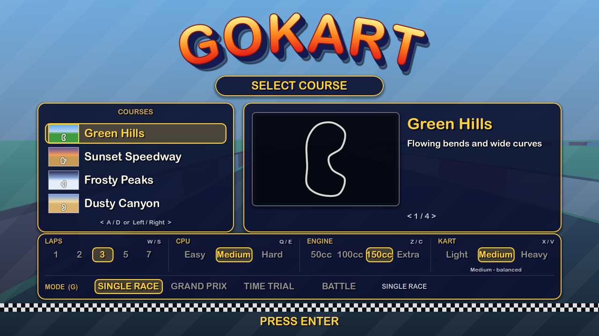

# GoKart

A Mario Kart–style arcade kart racer built with **Godot 4** and GDScript. Everything — track, karts, effects — is generated procedurally from code; there are no imported art assets.

## Screenshots

| Green Hills | Sunset Speedway | Frosty Peaks | Dusty Canyon |
| --- | --- | --- | --- |
|  |  |  |  |




Taken with `godot --path . -s tools/random_drive.gd` (a bot that wanders the road, drifts and fires items at random), `tools/train_shot.gd`, `tools/menu_shot.gd` and `tools/hud_shot.gd`.

## Features


- **The train** (Mario Kart 64 Kalimari Desert): Dusty Canyon has a railway loop that crosses the road at two level crossings, and two steam trains (locomotive with a smoking chimney and a "64" plate, tender, three coaches) circle it without end. A crossbuck signal before each crossing flashes its red lamps and a bell rings while a train is close or passing; drive into a car and you are **thrown into the air**, spun out and shoved along the train (a Star or Boo goes straight through). CPU karts always stop and wait at a blocked crossing, like MK64's; the walls open where the rails cross and the minimap shows the railway (`scripts/train.gd`, `scripts/railway.gd`, `TrackData` `rail` layout / `crossings`, `Kart.launch`, `AiDriver.wait`)

- **Arcade kart physics** with drifting and mini-turbo boosts (release a drift to boost), off-road slowdown and wall collisions (`scripts/kart_physics.gd`)
- **Procedural closed-circuit tracks** with meshes, walls and animated boost pads; four tracks — a Mario Kart 64 cup's worth — (Green Hills, Sunset Speedway, Frosty Peaks and the desert course Dusty Canyon with its sweepers, hairpin and oasis) with their own layout, item boxes, hazards and sky/ground colours (`scripts/track_data.gd`, `scripts/track.gd`, `scripts/track_library.gd`)
- **UI scales with the window** (canvas_items stretch, anchored HUD drawn above the speed effects so it stays sharp); 4x MSAA and steady, shadow-free striped walls
- **AI difficulty** Easy / Medium / Hard on the title menu (`TrackLibrary.DIFFICULTIES`), with Mario Kart 64–style **rubber-banding**: AI karts that fall behind you get a top-speed bonus and karts far ahead ease off, scaled by difficulty (`AiDriver.rubber_band`)
- **Engine classes** 50cc / 100cc / 150cc / Extra like Mario Kart 64 (Z / C on the title menu): the class scales every kart's top speed and acceleration, player and AI alike; **Extra** is MK64's mirror mode — 150cc speed on every course flipped left-to-right (the menu preview flips too, pads and hazards swap sides) (`TrackLibrary.ENGINE_CLASSES`, `KartPhysics.apply_engine_class`, `TrackData` `mirror` layout flag)
- **Weight classes** Light / Medium / Heavy like Mario Kart 64's driver roster (X / V on the title menu): light karts accelerate fastest but get thrown aside, heavy karts have the highest top speed, the slowest pick-up and shove others out of the way; kart-to-kart bumps throw both karts apart along the contact, the lighter one much further and slowed, the heavier one keeping its speed. The 7 AI karts mix all three classes and heavy karts are visibly bigger (`scripts/kart_weight.gd`, `Kart.apply_weight_class`, `Kart._bump`, `Main.AI_SPECS`)
- **Title menu** laid out like Mario Kart 64's select screens: a slanted red logo with a gold rim, a "SELECT COURSE" banner, the course list on the left with the highlighted row lit in gold, the course map and blurb in a framed window and a row of option cells (laps, CPU, engine, kart, mode) underneath; a rounded system font with soft drop shadows instead of heavy black outlines. A / D or arrows pick the track, W / S the lap count (1/2/3/5/7), Enter races; Esc in a race returns to it (`scripts/menu.gd`)
- **Grand Prix cup** (G on the menu): all four tracks are raced in turn like an MK64 cup, Mario Kart 64 points (9 / 6 / 3 / 1) add up after each race, the standings follow the results and the cup ends with a gold, silver or bronze trophy. MK64 cup rules: finish **5th or worse and you rank out** — nothing is scored and the same race is run again (unlimited retries, the HUD shows "RACE 2 / 4  RETRY"); and from the second race on **everyone starts where they finished** the last race (win and you take pole, the player starts 8th only in the first race) (`scripts/grand_prix.gd`, `Main.GRID_SLOTS`)
- **Time Trials** (G again on the menu), Mario Kart 64 style: race alone for 3 laps at 100cc with a triple mushroom and no item boxes; the five best times and the best lap of each track are saved (`user://time_trials.cfg`) and your fastest run comes back as a see-through, untouchable ghost kart that drives the exact same path on the next attempt (`scripts/time_trial.gd`, `scripts/ghost_recording.gd`, `scripts/ghost_kart.gd`)
- **3-lap races** with ordered checkpoints and live race ranking (`scripts/lap_tracker.gd`, `scripts/race_ranking.gd`)
- **Start countdown** (3-2-1-GO) with a Mario Kart 64 rocket start: press the throttle just before the blue light for a boost; hold it too early and the kart does a **false start** — tires burn out in a cloud of smoke, the engine revs and the kart sits still for 1.5 s (`scripts/race_start.gd`, `stall` in `scripts/kart_physics.gd`)
- **Lakitu**, the Mario Kart 64 referee on his cloud: he hovers ahead of your kart holding the start signal on his fishing rod (lamps light red, red, then blue at GO), holds up a green "LAP 2" / "FINAL LAP" sign as you cross the line, waves the checkered flag when you finish, and flashes a red **REVERSE** sign if you drive the wrong way for a second. Every course has **water** beside the road along two open stretches (no wall there, on the outside of a bend; mirrored with the Extra class): drive off the edge and you splash in, Lakitu fishes you out on his line (lifted, carried over the centreline and set down facing the right way, speed gone — a few seconds lost, AI karts too) (`scripts/lakitu.gd`, `TrackData` `water` layout / `in_water` / `has_wall`, `Kart.start_rescue`)
- **Battle mode** (G again on the menu), Mario Kart 64 Balloon Battle: four karts with three balloons each in one of three arenas picked with Left/Right — **Big Donut** (a ring around a lava pit), **Block Fort** (four solid forts, shells ricochet off everything) and **Skyscraper** (a rooftop with no railings). Any item hit, a fall into the lava / off the roof, a star kart's touch or a hard shove from a heavier kart pops a balloon; with none left you become a **Mini Bomb Kart** that can still drive (no items) and blows up on the first balloon kart it rams, costing it a balloon. Last kart with balloons wins; battle AI hunts item boxes when empty-handed and chases the nearest balloon kart with an item, feeling its way around the walls, forts and the lava. Only the MK64 battle items are rolled (no blue shell, lightning, golden or triple mushrooms) (`scripts/battle.gd`, `scripts/arena_data.gd`, `scripts/arena.gd`, `scripts/battle_ai.gd`, `scripts/balloons.gd`, `scripts/battle_main.gd`)
- **AI opponents** — a Mario Kart 64 field of 8 racers on a two-column grid (you start at the back) — using pure-pursuit steering, corner speed limiting, stuck recovery and item use (`scripts/ai_driver.gd`, grid in `scripts/main.gd`)
- **Items** from rainbow `?` item boxes with a roulette: mushroom, triple mushrooms (three boosts, "x3" counter on the HUD), golden mushroom (Mario Kart 64 style: unlimited boosts for 7.5 s after the first press, never rolled by the leader), banana, banana bunch (five bananas trailing the kart, dropped one at a time), fake item box (Mario Kart 64 decoy: an upside-down "¿" box dropped behind the kart that spins out whoever drives into it, rolled mostly by the front of the pack), green shell (ricochets), red homing shell, triple shells (three orbiting green shells fired one by one), triple red shells (Mario Kart 64: three red homing shells orbiting the kart, fired one by one and shielding it meanwhile; 2nd place and back only, never the leader), blue spiny shell (hunts the leader along the road and explodes), star, lightning and Boo (Mario Kart 64 ghost: the kart turns see-through and untouchable for 5 s while a little ghost flies to a random rival, takes its item and brings it back; never rolled by the leader) (`scripts/items.gd`, `item_holder.gd`, `item_manager.gd`, `item_projectile.gd`). Getting hit spins the kart out; lightning shrinks and slows every rival (`lightning_bolt.gd`). **Shell blocking** (Mario Kart 64): a banana, fake item box, shell or banana bunch you hold dangles behind the kart and takes the hit from an incoming green or red shell (both are spent, one charge of a bunch), orbiting triple shells shield the kart the same way, and a shell that runs into a banana or fake box lying on the road wipes it out — a white puff and a "block" clink mark it; blue shells fly over everything.
- **Visual effects**: drift sparks, boost flames, tire trails, speed lines / boost blur, and custom shaders in `shaders/`
- **Results screen**: after you finish, an autopilot takes over and a standings table with MK64 points appears on a navy panel with a gold rim; Enter restarts, or moves on to the next cup race (`scripts/race_results.gd`)
- **Procedural audio**: synthesized engine loop (pitch follows speed), tire screech while drifting, countdown beeps, boost / mini-turbo / item / hit / explosion / lightning / star / Boo / splash / burnout / crossing-bell / train-crash sounds and a finish jingle, plus positional 3D engine hum on each AI kart, with no audio files (`scripts/ai_engine_audio.gd`, `scripts/sound_synth.gd`, `scripts/game_audio.gd`)
- **HUD** with place, lap, item slot and a track minimap (with the railway on Dusty Canyon), styled like the menu (`scripts/ui_style.gd`): the same rounded font, gold / cream text with drop shadows and no black outlines; only the countdown and the FINISH! / YOU WIN! banners are gold "signs" with a dark red rim like the logo (`scripts/hud.gd`, `scripts/minimap.gd`)
- **Procedural kart model** with steering front wheels and spinning wheels (`scripts/kart_model.gd`)

## Controls

| Key | Action |
| --- | --- |
| W / S or Up / Down | Accelerate / brake |
| A / D or Left / Right | Steer (eased in, Mario Kart style) |
| Space or Shift | Drift (release for mini-turbo) |
| E, Enter or Ctrl | Use the held item (a hint shows under the item name) |
| Q / E (menu) | AI difficulty: Easy / Medium (default) / Hard |
| Z / C (menu) | Engine class: 50cc / 100cc / 150cc (default) / Extra (150cc on mirrored courses) |
| X / V (menu) | Kart weight: Light / Medium (default) / Heavy |
| G or Tab (menu) | Mode: Single Race / Grand Prix / Time Trial / Battle |
| Enter | Race / battle again (or your ghost) or next cup race (on the results screen) / start (menu) |
| Esc | Back to the track / arena menu |

## Download

Prebuilt binaries are on the [releases page](https://github.com/AgentiLoop/GoKart/releases/latest) — no Godot install needed:

| Platform | Download |
| --- | --- |
| macOS (universal: Apple silicon and Intel, Developer ID signed and notarized) | `GoKart-<version>-macos-universal.zip` |
| Windows (x86_64, unsigned — expect a SmartScreen prompt) | `GoKart-<version>-windows-x86_64.zip` |
| Linux (x86_64) | `GoKart-<version>-linux-x86_64.tar.gz` |
| Linux (arm64) | `GoKart-<version>-linux-arm64.tar.gz` |

Each download is a single self-contained binary with the game data embedded. `SHA256SUMS.txt` on the release page lists the checksums.

## Running from source

Requires [Godot 4.4+](https://godotengine.org/).

```sh
git clone https://github.com/AgentiLoop/GoKart.git
cd GoKart
godot --path .          # run the game (opens the title menu: scenes/menu.tscn)
```

## Testing

```sh
./run_tests.sh                                  # headless unit tests (tests/)
godot --headless --path . -s tools/smoke.gd -- 1  # headless race smoke test with AI karts (args = track index 0-3, engine class: `-- 3 3` = Dusty Canyon mirrored)
godot --headless --path . -s tools/menu_check.gd  # menu -> race -> Esc flow check
godot --headless --path . -s tools/mirror_check.gd  # Extra (mirror) flow check (menu -> C -> mirrored race with 8 karts -> Esc)
godot --headless --path . -s tools/weight_check.gd  # weight class flow check (menu -> V -> Heavy -> race; a heavy player rams a parked light kart -> Esc)
godot --headless --path . -s tools/lakitu_check.gd  # Lakitu flow check (start signal lamps -> player dunked in the water -> rescued -> REVERSE sign -> Esc)
godot --headless --path . -s tools/battle_check.gd  # Battle flow check (menu -> G G G -> Block Fort -> balloons popped -> bomb kart explodes on the player -> player wins -> Esc)
godot --headless --path . -s tools/start_check.gd   # Rocket start / false start check (throttle held all countdown -> stall + smoke + burnout sound, window press -> boost; race + battle)
godot --headless --path . -s tools/block_check.gd   # Shell blocking check (dangling banana stops a red shell, green shell wipes out a road banana, orbiting triple shells stop a shell, triple red shells orbit red and home in one by one)
godot --headless --path . -s tools/train_check.gd   # Train check on Dusty Canyon (railway + signals built, AI kart waits at a blocked crossing while the lamps flash and the bell rings, then pulls away; the player is thrown into the air by the locomotive -> Esc)
godot --headless --path . -s tools/battle_smoke.gd -- 1  # headless battle smoke test, every kart on the battle AI (arg = arena index)
godot --headless --path . -s tools/gp_check.gd    # Grand Prix flow check (menu -> cup race 1 -> results -> race 2 from pole -> rank out 6th -> retry the same race -> Esc)
godot --headless --path . -s tools/tt_check.gd    # Time Trial flow check (menu -> solo run -> record + ghost saved -> race the ghost -> Esc)
godot --path . -s tools/screenshot.gd           # visual check, writes /tmp/gokart_*.png
godot --path . -s tools/tt_shot.gd              # Time Trial with a synthetic ghost on the course -> /tmp/gokart_tt_*.png
godot --path . -s tools/mirror_shot.gd          # Extra class: mirrored menu preview + race -> /tmp/gokart_mirror_*.png
godot --path . -s tools/battle_shot.gd -- 1       # Battle: menu, start pads with balloons, a Mini Bomb Kart -> /tmp/gokart_battle_*.png
godot --path . -s tools/lakitu_shot.gd          # Lakitu: start signal, water edge, rescue, REVERSE sign -> /tmp/gokart_lakitu_*.png
godot --path . -s tools/train_shot.gd           # Dusty Canyon train: waiting at the crossing, thrown by the locomotive -> /tmp/gokart_train_*.png
godot --path . -s tools/hud_shot.gd             # restyled HUD: gold countdown sign, results table on its panel, pixel-sampled for the palette / no black outline -> /tmp/gokart_hud_*.png
godot --path . -s tools/random_drive.gd -- 1    # random drive, 3 screenshots -> /tmp/gokart_random_*.png (arg = track index, random if omitted)
```

## Project layout

```
scenes/   menu, race and battle scenes
scripts/  game logic (physics, track, AI, items, HUD, effects)
shaders/  boost pad, item box, shell, star and speed-fx shaders
tests/    unit tests and test runner
tools/    smoke test and screenshot helper
```
